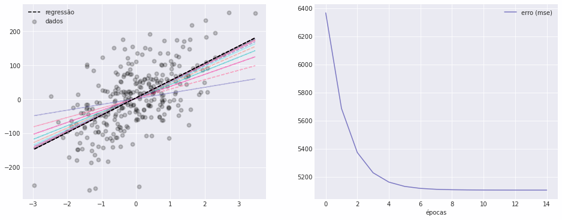

# Descida do gradiente

Implementação de estudo do algoritmo de descida do gradiente para otimização de problemas de regressão linear univariada.



## Ambiente

```bash
# instale as dependências
poetry install

# ative o ambiente (opcional)
source .venv/bin/activate

# ative o CI
pre-commit install  # ou poetry run pre-commit install
```
